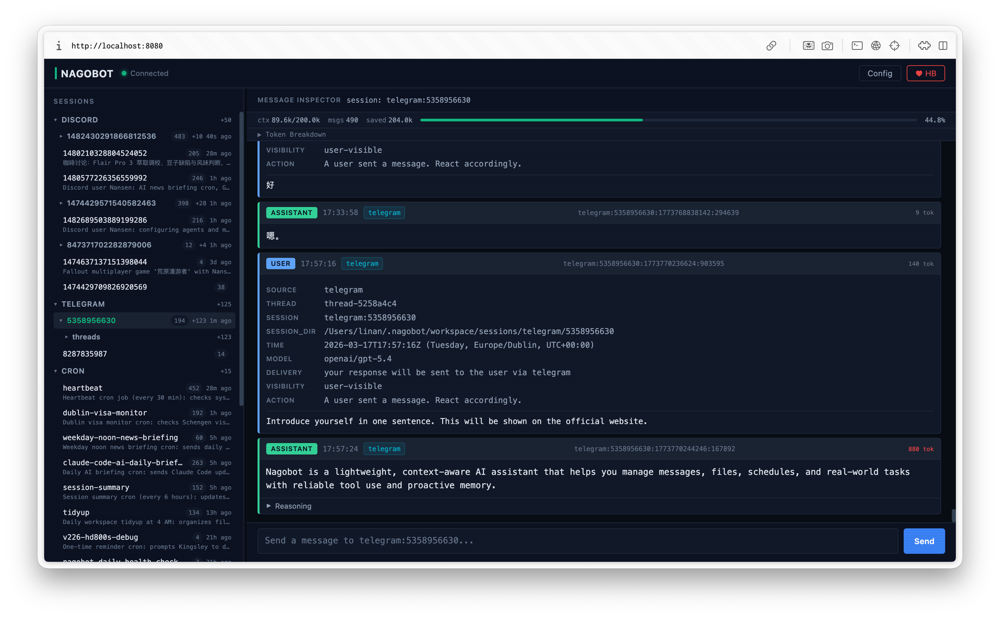
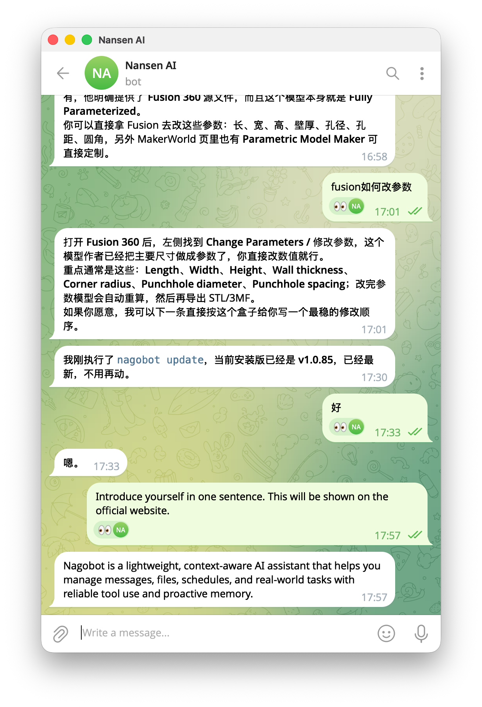

# nagobot

<p align="center">
  
</p>

<p align="center">
  Autonomous AI bot framework built with Go. Multi-channel, multi-provider, multi-agent.
</p>

<p align="center">
  <a href="https://nagobot.com">Website</a> · <a href="https://github.com/linanwx/nagobot/releases">Releases</a> · <a href="https://nagobot.com">Docs</a>
</p>

<p align="center">
  
</p>

<p align="center">
  
</p>

## Install

### Docker (recommended for servers)

```bash
mkdir nagobot && cd nagobot
curl -fsSLO https://raw.githubusercontent.com/linanwx/nagobot/main/docker-compose.yml
echo "DEEPSEEK_API_KEY=sk-..." > .env   # any provider key you have
docker compose up -d
```

Web UI on port 8080. All data (config, sessions, memory) lives in `./data` on the host — back it up with tar/rsync, migrate a bare-metal install by unpacking `~/.nagobot` into it. Update with `docker compose pull && docker compose up -d`.

The image (`ghcr.io/linanwx/nagobot`, amd64/arm64) ships python3 with document libs, poppler, node, and ripgrep, so the agent's exec tool is fully capable in the container. Add a `SILICONFLOW_API_KEY` or `OPENROUTER_API_KEY` to enable semantic pre-think (recommended — it powers destructive-action detection).

### Native (macOS / Linux)

```bash
curl -fsSL https://nagobot.com/install.sh | bash
```

Windows (PowerShell):
```powershell
irm https://nagobot.com/install.ps1 | iex
```

Then run the setup wizard:
```bash
nagobot onboard
```

This handles provider selection, API keys, channel configuration, and service installation. Re-run after updating.

Start chatting:
```bash
nagobot cli
```

## What it does

- **Multi-provider** — DeepSeek, Gemini, Anthropic, OpenAI, OpenRouter, Moonshot, Minimax, Zhipu
- **Multi-channel** — Telegram, Discord, Feishu, Web, CLI
- **Multi-agent** — Custom agent templates with async thread spawning
- **Always on** — Cron scheduling, auto-restart, three-tier context compression
- **38+ skills** — Web search, code execution, file management, and more

## Build from source

```bash
go build -o nagobot .
```

## Docs

- [Providers](docs/provider.md)
- [Channels](docs/channels.md)
